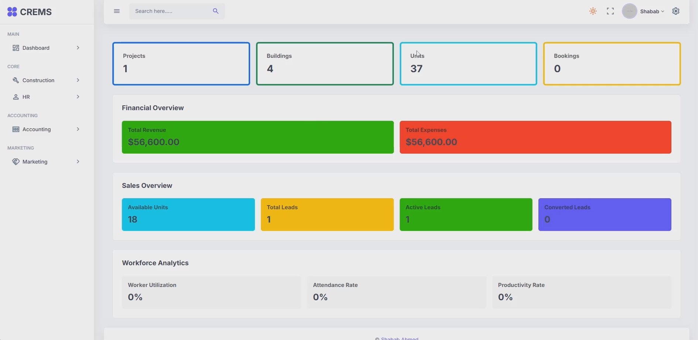
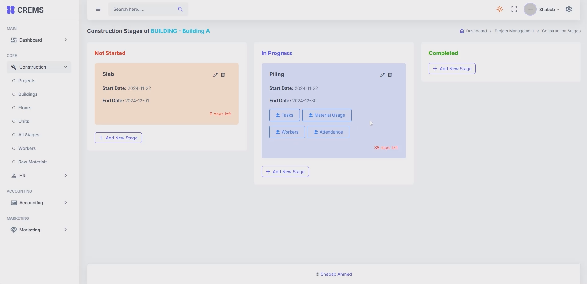

# Construction and Real Estate Management System

*This is an ongoing project developed as part of the ISDB-BISEW IT Scholarship training program. The system was built in a short time to demonstrate core concepts and functionality for managing construction and real estate processes.*

A solution to manage construction and real estate projects efficiently. The system provides tools for project management, accounting, marketing, and more, with a seamless integration between web and mobile platforms.

## Features

- **Projects Management**: Manage buildings, floors, and units with ease.
- **Raw Materials Tracking**: Record purchases and monitor material usage.
- **Worker Management**: Assign workers, track attendance, and manage payroll.
- **Accounting System**: Account statements.
- **Marketing and Sales**: Manage customer accounts, sales, and real estate bookings.
- **Multi-platform Support**:
    - **Backend**: Spring Boot
    - **Frontend**: Angular (Web), Flutter (Mobile)

## Tech Stack

- **Backend**: Spring Boot
- **Frontend**: Angular, Flutter
- **Database**: MySQL

## Previews

Previews:

  
  
  
  
  
  
  
  
  
